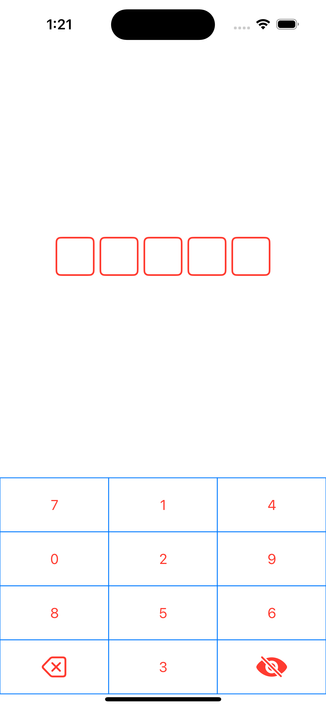
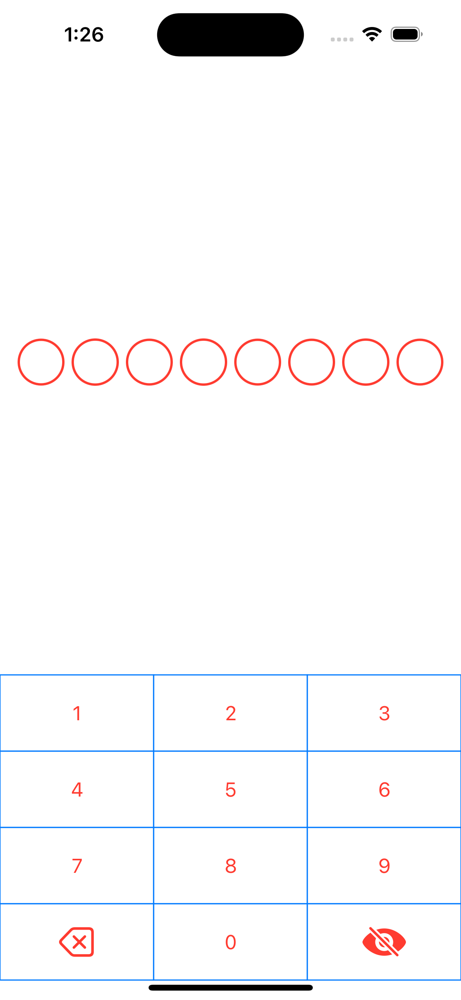
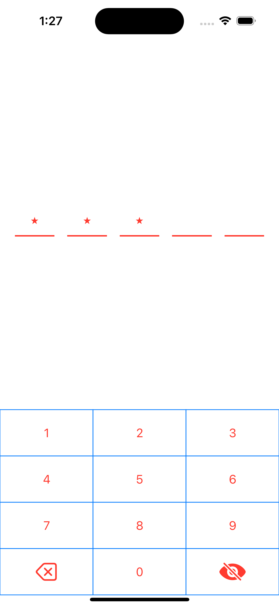
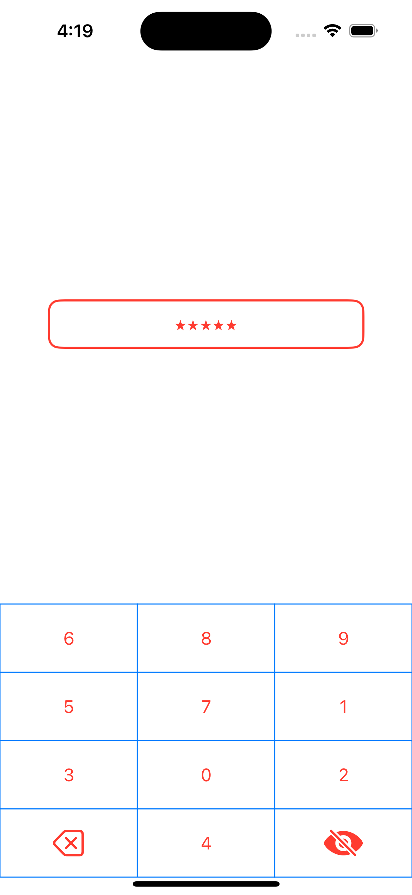

# SSOTPPinView

SSOTPPinView is a comprehensive library for iOS projects, designed to streamline the creation and customization of OTP (One Time Password) input views. With support for custom keyboards, extensive OTP view customization, and seamless integration with SwiftUI, SSOTPPinView provides a complete solution for secure and user-friendly OTP entry.

[![Swift Version][swift-image]][swift-url]
[![License][license-image]][license-url]
[![Carthage Compatible][carthage-image]][carthage-url]
[![SwiftPM Compatible][spm-image]][spm-url]
[![Platform][platform-image]][platform-url]
[![PRs Welcome][PR-image]][PR-url]

# Screenshots
| Box | Circle | Underline | None |
| :--: | :-----: | :--: | :--: |
|  |  |  |  |

 
# Features!
- Enhance user experience with a tailored keyboard designed for efficient and secure OTP input, or use the default iOS keyboards.
- Implement OTP input fields that are both functional and aesthetically pleasing.
- Personalize the appearance and behavior of the OTP view to match your app's unique style.
- Easily integrate SSOTPPinView into your SwiftUI projects for modern and responsive user interfaces.
  
# Requirements
  - iOS 16
  - Xcode 14

# Installation
 **CocoaPods**
 
- You can use CocoaPods to install SSOTPPinView by adding it to your Podfile:

       use_frameworks!
       pod 'SSOTPPinView'

-  
       import UIKit
       import SSOTPPinView
       
**Swift Package Manager**
 
- When using Xcode 11 or later, you can install SSOTPPinView by going to your Project settings > Swift Packages and add the repository by providing the GitHub URL. Alternatively, you can go to File > Swift Packages > Add Package Dependencies...

- import SSOTPPinView

####  Carthage
-   [Carthage](https://github.com/Carthage/Carthage) is a decentralized dependency manager that builds your dependencies and provides you with binary frameworks.You can install Carthage with [Homebrew](http://brew.sh/) using the following command:
```bash
$ brew update
$ brew install carthage
```
To integrate `SSOTPPinView` into your Xcode project using Carthage, add the following line to your `Cartfile`:

```ogdl
github "SimformSolutionsPvtLtd/SSOTPPinView"
```
Run `carthage` to build and drag the `SSOTPPinView`(Source/SSOTPPinView) into your Xcode project.

**Manually**

- Add SSOTPPinView folder from /Sources folder to your project.

# Usage

```swift
    
SSOTPPinView(textFieldType: .OTP_VIEW_TYPE_BOX, numberOfCount: 5, keyboardOptions: .customRandomDigitsType) { newValue in
                self.otp = newValue
                print(otp)
            }
            .isSecureTextEntry(true)
            .keyFontColor(.blue)
            .keyFontColor(.black)
            .secureTextType(.star)
            .textColor(.red)
            .fontWeight(.bold)
            .lineColor(.red)
            .lineWidth(2)
            .keyboardBackgroundColor(.white)
            .keyFontColor(.red)
            .keyStrokeColor(.blue)
    
```
## 🤝 How to Contribute

Whether you're helping us fix bugs, improve the docs, or a feature request, we'd love to have you! :muscle:

Check out our [**Contributing Guide**](CONTRIBUTING.md) for ideas on contributing.

## Find this example useful? ❤️

Give a ⭐️ if this project helped you!

## Check out our other Libraries

<h3><a href="https://github.com/SimformSolutionsPvtLtd/Awesome-Mobile-Libraries"><u>🗂 Simform Solutions Libraries→</u></a></h3>

## MIT License

This project is licensed under the MIT License - see the [LICENSE](LICENSE) file for details

    
[swift-image]:https://img.shields.io/badge/swift-5.0-orange.svg
[swift-url]: https://swift.org/
[carthage-image]:https://img.shields.io/badge/Carthage-compatible-4BC51D.svg?style=flat
[carthage-url]: https://github.com/Carthage/Carthage
[spm-image]:https://img.shields.io/badge/SwiftPM-compatible-brightgreen.svg
[spm-url]: https://swift.org/package-manager
[license-image]: https://img.shields.io/badge/License-MIT-blue.svg
[license-url]: LICENSE
[travis-image]: https://img.shields.io/travis/dbader/node-datadog-metrics/master.svg?style=flat-square
[travis-url]: https://travis-ci.org/dbader/node-datadog-metrics
[codebeat-image]: https://codebeat.co/assets/svg/badges/C-ffb83f-7198e9a1b7ad7f73977b0c9a5c7c3fffbfa25f262510e5681fd8f5a3188216b0.svg
[codebeat-url]: https://codebeat.co/projects/github-com-vsouza-awesomeios-com
[platform-image]:https://img.shields.io/cocoapods/p/LFAlertController.svg?style=flat
[platform-url]:http://cocoapods.org/pods/LFAlertController
[cocoa-image]:https://img.shields.io/cocoapods/v/EZSwiftExtensions.svg
[cocoa-url]:https://img.shields.io/cocoapods/v/LFAlertController.svg
[PR-image]:https://img.shields.io/badge/PRs-welcome-brightgreen.svg?style=flat-square
[PR-url]:http://makeapullrequest.com

